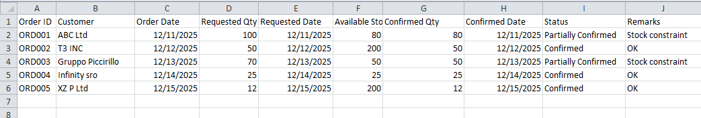

## Sample Data Model
This repository includes a simple Excel-based model used to simulate real-world
order management and delivery coordination scenarios.

The file demonstrates how demand, availability, and exceptions are evaluated
to support realistic delivery commitments and escalation decisions.
>This Mirrors the SAP-SD order and schedule thinking
Screenshot of the excel sheet:
## Sample View

